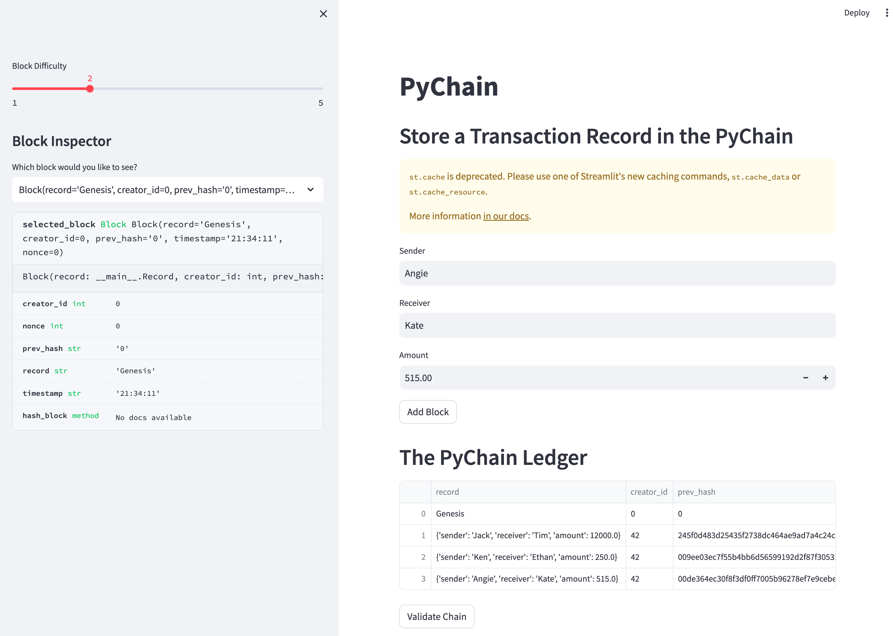
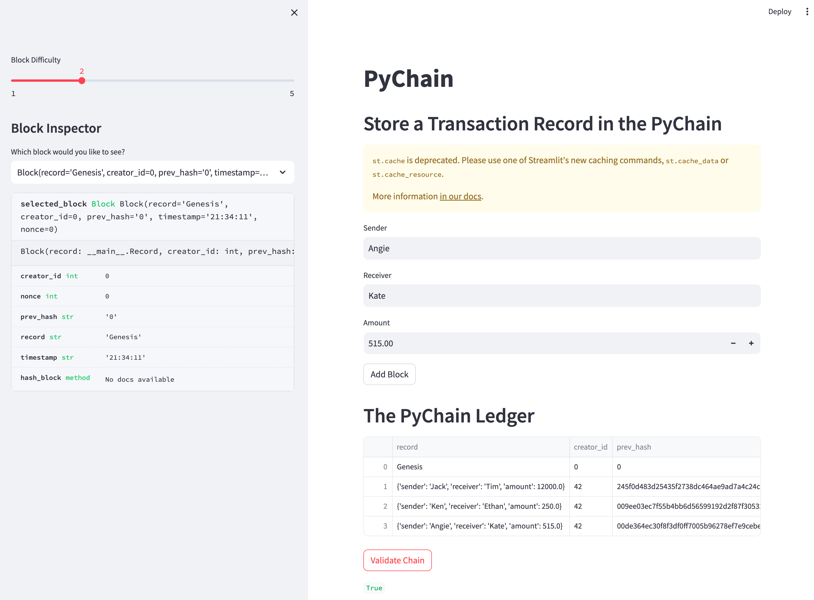
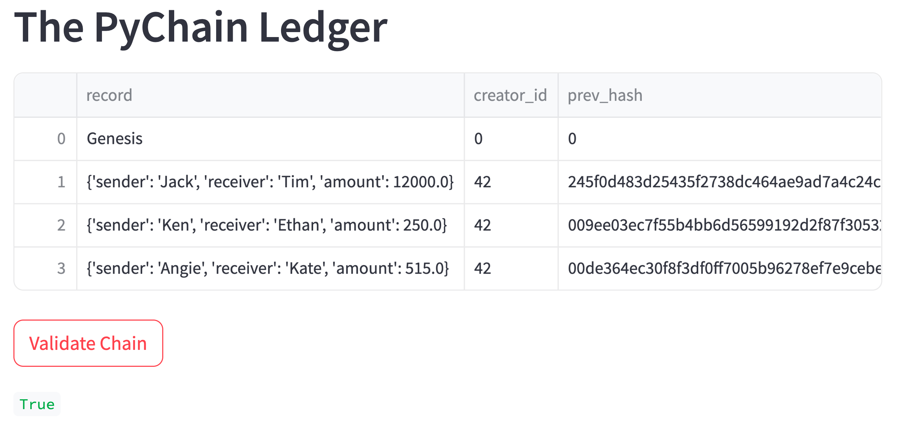
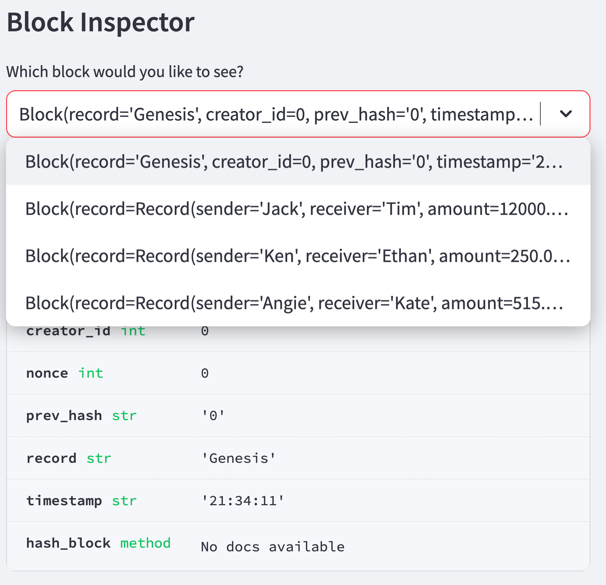

# Module 18 Challenge - PyChain Ledger


## Overview

For this challenge I assume the role of a fintech engineer working in the decentralized finance team for a top bank. The challenge is to build a blockchain-based ledger system with user-friendly web interface that will allow partner banks to send and receive money and verify the integrity of the data in the ledger. 

## End-user Instructions


## Application Results

Below are screenshots for the web application using Streamlit technology.

### Web application showing blockchain with multiple blocks


### Web application showing the chain validation
<small>(see `True` in bottom center of screenshot)</small>


### Chain validation zoomed in


### Close-up of expanded block inspector pulldown



## Project Steps

## Step 1: Create a Record Data Class

## Step 2: Modify the Existing Data C

Alphabet Soup has provided a dataset in `csv` format with over 34,000 records of previous organizations who received funding, including whether or not the funding recipient was ultimately successful. 

The dataset includes the following input features (X):
* EIN
* NAME
* CLASSIFICATION
* APPLICATION_TYPE
* AFFILIATION
* USE_CASE
* ORGANIZATION
* STATUS
* INCOME_AMT
* SPECIAL_CONSIDERATIONS
* ASK_AMT

*EIN and NAME will be dropped from the features data prior to modeling.*

The output target (y) will be:
* IS_SUCCESSFUL

## Libraries and Dependencies

The [notebook](venture_funding_with_deep_learning.ipynb) loads the following libraries and dependencies.

```python
# Imports
import pandas as pd
from pathlib import Path
import tensorflow as tf
from tensorflow.keras.layers import Dense
from tensorflow.keras.models import Sequential
from sklearn.model_selection import train_test_split
from sklearn.preprocessing import StandardScaler,OneHotEncoder

import warnings
warnings.filterwarnings('ignore')
```

## Preprocessing of the Data

Several features were dropped (EIN and NAME) due to the irrelevance of the data to the deep learning model goals. 

`OneHotEncoder` from `scikit-learn` was used to convert the categorical data (identified using `.dtypes`) to binary numerical values for the model and placed into a dataframe which was concatenated with the original dataframe's numerical values.

The features (X) and target (y) were split into training and testing datasets using the `train_test_split` function from the `scikit-learn` machine learning library. The datasets were then scaled utilizing `StandardScaler()`.

## Binary Classification Models using a Neural Network

Three distinct deep learning models using a neural network were compiled for analysis and evaluation using TensorFlow Keras. The following are the details and results of each binary classification model. 

### Original Model

| Layer(type)  | Output Shape | Param # | Activation |
|-------|:-------:|:------------:|:------------:|
| Dense | 58    | 6,786       | relu       |
| Dense 1 | 29    | 1711       | relu       |
| Dense 2 | 1     | 30       | sigmoid       |

Sequential model parameters:
* Loss function: binary_crossentropy
* Optimizer: adam
* Metrics: accuracy
* No. of epochs: 50

### Alternative Model 1 (optimization attempt)

| Layer(type)  | Output Shape | Param # | Activation |
|-------|:-------:|:------------:|:------------:|
| Dense 3 | 58    | 6,786       | relu       |
| Dense 4 | 29    | 1711       | relu       |
| Dense 5 | 15     | 450       | relu       |
| Dense 6 | 1     | 16       | sigmoid       |

Sequential model parameters:
* Loss function: binary_crossentropy
* Optimizer: adam
* Metrics: accuracy
* No. of epochs: 50

### Alternative Model 2 (optimization attempt)

| Layer(type)  | Output Shape | Param # | Activation |
|-------|:-------:|:------------:|:------------|
| Dense 7| 29    | 3,393       | n/ap       |
| LeakyReLU | 29    | 0       | leaky_re_lu       |
| Dense 8 | 7     | 210       | n/ap       |
| LeakyReLU | 7     | 0       | leaky_re_lu       |
| Dense 9 | 2     | 16       | n/ap       |
| LeakyReLU | 2     | 0       | leaky_re_lu       |
| Dense 10 | 1     | 3       | sigmoid       |

Sequential model parameters:
* Loss function: binary_crossentropy
* Optimizer: adam
* Metrics: accuracy
* No. of epochs: 50

## Results for comparison and evaluation

| Model  | Accuracy | Loss | Step Details |
|-------|:-------:|:------------:|:------------|
| Original Model| 0.7307    | 0.5545       | 0 - 658us/step       |
| Alternative Model 1 | 0.7303    | 0.5573       | 0 - 1ms/step       |
| Alternative Model 2 | 0.7304     | 0.5523       | 0 - 1ms/step       |

## Summary

All three models had an approximate accuracy of 0.73 and an approximate loss of 0.55 (A2 was 0.56) when rounded to the nearest hundredth. The original model was the least complex with two hidden layers and one output layer. Its simplicity is seen in the step detail performance of 0 to 658us (microseconds). I would recommend the original model for these reasons. 

If I were to investigate further models for optimization, I would experiment with fewer hidden layers, fewer nodes, and more and less epochs, among other approaches. 

## Sources

The following sources were consulted in the completion of this project. 

* [pandas.Pydata.org API Reference](https://pandas.pydata.org/docs/reference/index.html)
* [Tensorflow Keras documentation](https://www.tensorflow.org/guide/keras)
* [scikit-learn documentation](https://scikit-learn.org/stable/)
* UCB FinTech Bootcamp instructor-led coding exercises
* ChatGPT for LeakyReLU integration syntax